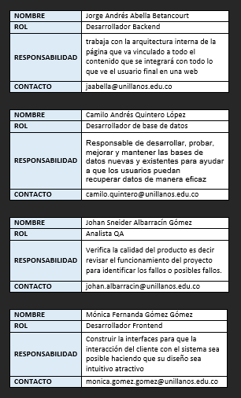

<b><h1 style="color:#64ffda;"> TutoTics</h1></b>

_________________________________________________________________
<h2 style="color:#14cba8;">Descripcion del problema: </h2>

La universidad de los llanos historicamente ha presentado una gran deficiencia en el sistema de tutorias que se van a tener en el semestre lectivo, ya que al iniciar cada semestre tanto los estudiantes como los profesores deben establecer un horario para dicha actividad teniendo en cuenta la disponibilidad horaria de todos los estudiantes inscritos o al menos la mayoria. Se propone como solucion para este problema el desarrollo de un software, el cual compara los diferentes horarios de todos los estudiantes inscritos o al menos la mayoria. Se propone como solucion para este problema el desarrollo de un software, el cual compara los diferentes horarios de todos los estudiantes que estan inscritos en el curso y asigna la tutoria, apoyandose en los espacios libres que tengan la mayoria de los estudiantes.

<h2 style="color:#14cba8;">Requerimiento principal:</h2>

En base a todos los requerimientos se escogieron lo mas importantes los cuales serían:  
-	Generar Tutoria  
-	Ver horario  

<h2 style="color:#14cba8;">Metodología seleccionada:</h2>

Se implemento una metodología Kanban porque no hay requisitos obligatorios para la estimación y, por lo general, está libre de una gran planificación. Kanban está abierto a realizar cambios durante el proceso de trabajo, se pueden agregar nuevos elementos. Significa que hay menos rigidez y las cosas pueden cambiar con frecuencia. Es por eso que mediante un tablero kanban el cual tiene las columnas:

TO DO - IN PROGRESS - TEST - DONE 

En donde se plantearon las siguientes tareas:

<h3>Generar tutoría</h3>

- Desarrollo de la interfaz (Bootstrap)  
- Configuración de la base de datos PostgreSQL (PgAdmin)  
- Alimentar la BD con horarios de estudiantes y profesores (Script)  
- Configurar los datos de la BD que se mostraran en la interfaz  
- Desarrollar algoritmo que busque un horario optimo de un curso (Python)  
- Testear el algoritmo de busqueda de horarios optimos para tutorias  
- Desplegar solución en el servidor principal

<h2 style="color:#14cba8;"> Asignacion de roles: </h2>

Product Owner: Olga Lucero Vega Márquez

Kanban Master: Camilo Andres Quintero Lopez

Kanban Team: 

# Pruebas 
## Pruebas unitarias 
Se utilizan para comprobar el correcto funcionamiento de las unidades individuales más pequeñas de los programas informáticos

En Django se implementó una Liberia "Pytest" ayuda al testeo de funcionalidades especificas dentro del proyecto. Se creó un archivo pytest.init para inicializar es módulo de la Liberia y pueda leer los archivos test_Name, dentro de cada archivo se comprueba cierta funcionalidad. En este caso la creación del usuario.

# Descripción Técnica

# TutoTics
It's academic project created to help teachers and students in the organization of their schedule in tutorials
    
    
## Initial setup    
 You must create a file in the root of the project with the name .env with the following data:    
    
    #Django
    DEBUG=False      
    SECRET_KEY=8^dv4m()q9_u+rc6f4k#&6qzdivz*94cd^-lr)ktdz7agosgob      
    TZ=America/Bogota      
    DJANGO_SETTINGS_MODULE=tuto.settings    
          
    #Postgres      
    POSTGRES_DB=tuto_db      
    POSTGRES_USER=tuto_user      
    POSTGRES_PASSWORD=tuto2021**.      
    POSTGRES_HOST=postgres      
    POSTGRES_PORT=5432      
          
    
 Then you must run the following command to build all the project containers:    
    
 $ make build    
Finally you should generate the initial Django migrations, for them execute the following command    
    
 $ make migrate    
## Run project    
 To run the project you must execute the following command    
    
 $ make up    
> If you have problems connecting Django with Postgres, you should run the command: make restart CONTAINER=django    
 ## Other commands    
    
 1. **Create a new app:** make startapp NAME=example    
 2. **Generate migrations:** make migrate    
 3. **Create a superuser:** make superuser  
  

## Sort packages in the requirements.txt file

First you need to add the package to the requirements.txt file, then you run the **make build** command.
Finally, so that the packages are ordered and with their version established in the requirements.txt file, you must execute the following command.

    $ make get-requirements

